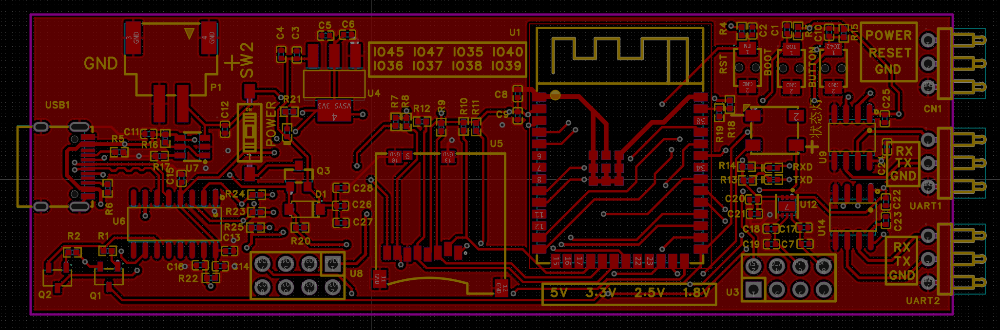
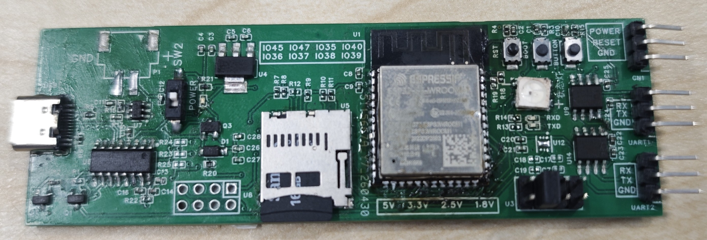

# 串口服务器

[](LICENSE)
[](https://www.espressif.com/)
[](https://www.arduino.cc/)
[](doc/README.md)

安全加固的 ESP32-S3 双模式串口网关工程。项目将 UART、USB CDC、TCP 客户端、TCP 服务器、Web 管理页和 SD 日志整合到单一固件中，适合做串口设备联网、现场调试、数据采集网关和多终端透传。

## 项目功能介绍

本项目由自研硬件平台与嵌入式固件两部分组成，面向串口设备联网、现场运维和数据采集场景，提供从底层串口接入到网络通信、Web 管理和本地日志存储的一体化方案。

- 软件部分：基于 ESP32-S3 与 Arduino 框架开发，支持客户端模式与服务器模式切换，集成 UART 透传、USB CDC 调试、TCP 通信、Web 管理页面、AT 指令配置、EEPROM 参数保存、SD 卡日志记录以及安全加固机制。
- 硬件部分：自定义设计了配套控制板，板上集成 ESP32-S3、双路 UART 接口、SD 卡槽、电池检测、电源控制、状态指示灯与功能按键，可直接作为串口联网网关或现场调试节点使用。
- 工程交付：仓库同时提供固件源码、原理图、PCB、3D 视图和实物图，硬件已经完成打板贴片并经过实物验证，硬件源文件可通过嘉立创 EDA 直接打开。

## 项目亮点

- 单固件双模式：同一份代码可在客户端模式和服务器模式之间切换。
- 双串口通道：UART2 负责主透传链路，UART1 提供独立调试/采集通道。
- Web 管理界面：支持串口监视、日志查看、配置修改、客户端查看和电源控制。
- SD 卡日志：支持异步批量写入、按模式和通道分目录保存、可选时间戳。
- EEPROM 持久化：保存运行模式、波特率、客户端 ID 和 WiFi 配置。
- 安全加固：统一输入校验、帧格式检查、白名单过滤、错误计数、超时与来源封禁。

## 适用场景

- UART 设备远程联网透传
- 多终端接入的本地串口采集网关
- 带 Web 运维面的嵌入式串口服务器
- 需要本地日志落盘的现场调试设备

## 运行模式


| 模式       | 网络角色                 | 默认网络行为                                  | 典型用途                   |
| ---------- | ------------------------ | --------------------------------------------- | -------------------------- |
| 客户端模式 | WiFi STA + TCP Client    | 连接已配置 WiFi，向 192.168.1.1:8080 发起连接 | 设备主动接入上位机/网关    |
| 服务器模式 | WiFi SoftAP + TCP Server | 启动 AP，监听 8080，最多 5 个客户端           | 本地串口网关、现场调试热点 |

## 快速开始

### 1. 环境准备

- Arduino IDE 或 Arduino CLI
- ESP32 Arduino Core 3.3.8
- WiFiManager 2.0.17
- FastLED 3.10.3
- Windows PowerShell 5.1 或更高版本

### 2. 编译

```powershell
.\compile.ps1
```

说明：脚本会调用 Arduino CLI，并将产物输出到 build/esp32.esp32.esp32s3。

- 默认使用与 Arduino IDE 一致的 ESP32-S3 板卡选项执行增量编译
- 默认使用 Arduino CLI 的临时构建目录，尽量贴近 Arduino IDE 的构建行为
- 默认将 Arduino CLI 输出直接显示到终端，避免逐行写日志拖慢构建
- 如需强制全量重编，可执行 `./compile.ps1 -Clean`
- 如需压缩终端输出，可执行 `./compile.ps1 -NoVerbose`
- 如需同时保存编译日志，可执行 `./compile.ps1 -LogToFile`
- 如需固定构建目录，可执行 `./compile.ps1 -BuildPath .\build\esp32.esp32.esp32s3`

### 3. 烧录

```powershell
.\build_and_flash.ps1 -Port COM5
```

说明：该脚本会直接调用 Arduino CLI 完成 compile、upload 和 verify，默认走临时构建目录以贴近 Arduino IDE。

### 4. 首次启动建议

1. 上电后通过 USB 串口观察基础状态。
2. 如果处于客户端模式且未配置 WiFi，设备会自动进入配网模式。
3. 如果处于服务器模式，设备会启动 SoftAP、Web 页面和 TCP 服务。
4. 进入 Web 页面或发送 AT 指令完成参数调整。

## 文档导航

- [文档中心](doc/README.md)
- [硬件设计资料](doc/hardware/README.md)
- [系统架构](doc/architecture/README.md)
- [模块说明](doc/modules/README.md)
- [配置与接口](doc/configuration/README.md)
- [构建、烧录与运维](doc/operation/README.md)
- [安全设计](doc/security/README.md)

## 硬件设计资料

项目文档已补充硬件视图整理，包含原理图、PCB 图、3D 仿真图与实物图对应说明，适合在阅读代码、查看引脚定义和做结构装配时交叉对照。


| 原理图                         |
| ------------------------------ |
|  |


| PCB 正面                          |
| --------------------------------- |
|  |


| PCB 背面                           |
| ---------------------------------- |
|  |


| 3D 仿真图                        |
| -------------------------------- |
|  |


| 实物图                         |
| ------------------------------ |
|  |

- [硬件设计资料总览](doc/hardware/README.md)
- 重点包含原理图、PCB 正反面、3D 仿真图与实物图的接口分布、按键位置、SD 卡槽与 UART 接口对照
- 本项目硬件已经完成打板与贴片，并基于实物进行了功能验证
- 上传的硬件源文件可使用嘉立创 EDA 直接打开，源文件位于 [PCB/dual-mode-uart-enhanced_v0.8.dsn](PCB/dual-mode-uart-enhanced_v0.8.dsn)

## 仓库结构

```text
.
|-- dual-mode-uart-enhanced.ino   # 主入口、全局配置、setup/loop
|-- client_server_mode.ino        # 客户端/服务器模式状态机
|-- config_management.ino         # EEPROM、默认配置、按键切换
|-- uart_interrupt.ino            # UART1/UART2 DMA 与 TCP 发送缓冲
|-- uart_utility.ino              # USB AT 指令与本地串口透传入口
|-- web_server.ino                # Web 管理页面与 HTTP 路由
|-- battery_sd_management.ino     # 电池监测、SD 卡、日志落盘
|-- security_hardening.h/.ino     # 安全帧、白名单、超时与封禁
|-- compile.ps1                   # Arduino CLI 编译脚本
|-- build_and_flash.ps1           # 编译后烧录脚本
|-- PCB/                          # PCB 设计源文件和导出文件
`-- doc/                          # 详细工程文档（含硬件设计资料）
```

## 硬件摘要


| 功能                | 引脚                              |
| ------------------- | --------------------------------- |
| UART2 RX/TX         | GPIO16 / GPIO17                   |
| UART1 RX/TX         | GPIO19 / GPIO20                   |
| RGB LED             | GPIO48                            |
| BOOT 按键           | GPIO0                             |
| 配网触发            | GPIO42                            |
| SD SPI              | GPIO10 / GPIO11 / GPIO13 / GPIO12 |
| SD 电源控制         | GPIO8                             |
| 电池 ADC            | GPIO1                             |
| 电源控制 / 复位控制 | GPIO5 / GPIO4                     |

更完整的接线与配置说明见 [配置与接口](doc/configuration/README.md)、[硬件设计资料](doc/hardware/README.md) 和 [硬件源文件](PCB/dual-mode-uart-enhanced_v0.8.dsn)。

## 参与贡献

欢迎通过 Issue 或 Pull Request 提交问题、修复和改进建议。建议先阅读 [系统架构](doc/architecture/README.md) 与 [模块说明](doc/modules/README.md)，再开始修改代码。

## 许可证

本项目使用 [GNU GPL v3](LICENSE) 许可证。
