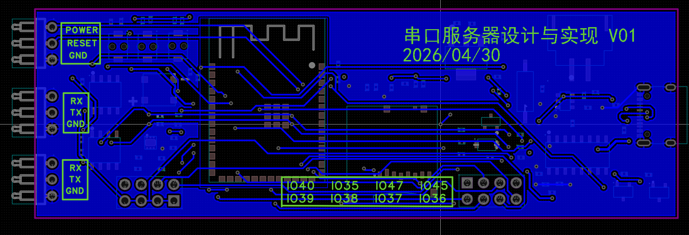

# 串口服务器

[](LICENSE)
[](https://www.espressif.com/)
[](https://www.arduino.cc/)
[](doc/README.md)

安全加固的 ESP32-S3 双模式串口网关工程。项目将 UART、USB CDC、TCP 客户端、TCP 服务器、Web 管理页和 SD 日志整合到单一固件中，适合做串口设备联网、现场调试、数据采集网关和多终端透传。

## 项目功能介绍

本项目由自研硬件平台与嵌入式固件两部分组成，面向串口设备联网、现场运维和数据采集场景，提供从底层串口接入到网络通信、Web 管理和本地日志存储的一体化方案。

- 软件部分：基于 ESP32-S3 与 Arduino 框架开发，支持客户端模式与服务器模式切换，集成 UART 透传、USB CDC 调试、TCP 通信、Web 管理页面、AT 指令配置、EEPROM 参数保存、SD 卡日志记录以及安全加固机制。
- 硬件部分：自定义设计了配套控制板，板上集成 ESP32-S3、双路 UART 接口、SD 卡槽、电池检测、电源控制、状态指示灯与功能按键，可直接作为串口联网网关或现场调试节点使用。
- 工程交付：仓库同时提供固件源码、原理图、PCB、3D 视图和实物图，硬件已经完成打板贴片并经过实物验证，硬件源文件可通过嘉立创 EDA 直接打开。

## 项目亮点

- 单固件双模式：同一份代码可在客户端模式和服务器模式之间切换。
- 双串口通道：UART2 负责主透传链路，UART1 提供独立调试/采集通道。
- Web 管理界面：支持串口监视、日志查看、配置修改、客户端查看和电源控制；服务器模式下补充了 captive portal 重定向，连接热点后访问任意 HTTP 地址可回到设备首页。
- SD 卡日志：支持异步批量写入、按模式和通道分目录保存、可选时间戳；日志预览页使用按偏移分页，保留首页、上页、下页和尾页导航，避免为统计总行数整文件扫描 SD 卡。
- EEPROM 持久化：保存运行模式、波特率、客户端 ID 和 WiFi 配置。
- 安全加固：统一输入校验、帧格式检查、白名单过滤、错误计数、超时与来源封禁。

## 适用场景

- UART 设备远程联网透传
- 多终端接入的本地串口采集网关
- 带 Web 运维面的嵌入式串口服务器
- 需要本地日志落盘的现场调试设备

## 典型硬件应用场景

本项目面向具备串口通信需求的嵌入式设备、控制终端与现场采集节点，可作为“串口联网接入单元”“运维调试单元”或“日志留存单元”部署于不同硬件系统中。典型应用场景如下：

| 应用场景 | 适用对象 | 推荐模式 | 应用价值 |
| ---------- | ------------------------ | --------------------------------------------- | -------------------------- |
| 存量设备联网改造 | 仅提供 UART 控制口、调试口或数据口的既有控制板、仪器仪表、传感器节点 | 客户端模式 | 在不改动原设备核心控制逻辑的前提下，实现串口设备快速联网和远程数据接入，降低旧设备数字化改造成本 |
| 现场调试与运维支撑 | 需要本地接入、状态查看、参数修改和日志回溯能力的嵌入式设备 | 服务器模式 | 提供 AP 热点、Web 管理页面、USB CDC 调试入口和日志留存能力，提升现场故障定位效率 |
| 数据采集与共享接入 | 需要多终端同时查看同一串口链路状态或参与协同调试的现场设备 | 服务器模式 | 支持 TCP 接入、客户端管理和串口数据共享，适合构建轻量化现场数据接入与协同分析节点 |
| 无人值守运行记录 | 需要持续采集并长期保留串口运行数据的控制箱、边缘终端或值守节点 | 客户端模式或服务器模式 | 依托 SD 卡分类落盘能力，支持异常追溯、运行取证、运维复盘和交付验收数据留存 |
| 便携式巡检工装 | 需要由运维人员携带至现场进行临时接入和快速诊断的调试设备 | 服务器模式 | 借助板载热点、双串口和状态显示能力，形成一体化便携式串口运维工具，提高巡检与抢修响应效率 |
| 双通道业务监测 | 主业务串口需要联网透传，辅助串口需要保留为维护、监测或旁路采集用途的设备 | 客户端模式或服务器模式 | 实现业务链路与运维链路分离，兼顾在线通信、辅助监测和后期扩展需求 |

上述场景尤其适用于具备 TTL/CMOS UART 接口的控制器、板卡和仪器设备；对于 RS-232、RS-485 等接口设备，可通过外接电平或总线转换模块完成系统适配。

## 被其他设备或系统集成的案例

本项目除可独立作为串口服务器或现场调试节点运行外，也适合集成到上位机系统、边缘网关、测试平台和行业设备中，作为底层串口接入与现场维护能力模块使用。典型集成方式如下：

| 集成对象 | 集成方式 | 本项目角色定位 | 集成成效 |
| --- | --- | --- | --- |
| 上位机软件或工控主机 | 本设备工作在客户端模式，主动连接指定 TCP 服务端，由上位机统一管理数据与指令交互 | 串口联网接入模块 | 实现串口设备远程接入、集中采集与集中控制，减少现场串口布线和人工值守 |
| 边缘网关或协议转换设备 | 由本设备完成 UART 数据采集与透传，再由上层网关开展协议适配、缓存处理或云端转发 | 现场前端接入节点 | 将分散的串口接口统一抽象为网络数据入口，提升边缘侧设备接入标准化水平 |
| 生产测试平台 | 通过 UART2 接入被测板卡，通过 Web、USB 和日志能力配合测试流程使用 | 测试记录与调试支撑模块 | 兼顾测试通信、过程留痕和结果追溯，适合应用于研发调试、产线测试和售后返修环节 |
| 智能终端整机 | 作为整机内部维护串口、远程诊断接口和运行日志节点嵌入到设备内部 | 内置维护服务单元 | 帮助整机保留本地维护能力的同时，扩展远程诊断、日志存储和售后支撑能力 |
| 现场监控与巡检体系 | 在服务器模式下由手机、平板、笔记本等终端直接接入设备热点实施查看和维护 | 临时接入式现场服务节点 | 无需依赖外部网络基础设施，即可完成临时接入、状态核验和多终端联调 |
| 行业业务系统 | 先由本设备完成底层 UART 接入，再由业务系统承接数据分析、展示、告警和流程联动 | 设备接入适配层 | 将底层串口接入能力与上层业务逻辑解耦，便于系统快速集成和后续功能扩展 |

从系统建设角度看，本项目适合作为“设备接入层”和“现场运维层”之间的基础能力组件：底层连接实际串口设备，上层衔接上位机、边缘网关、测试平台或行业应用系统，通过 TCP 通信、Web 配置和 SD 日志机制形成完整的接入、维护与追溯闭环。

## 应用效果与实施价值

该方案可将原本分散的串口调试、日志采集、网络转发和设备控制能力整合到单一固件与单一硬件节点中，减少现场人员在串口工具、网络调试工具、日志采集工具和控制接口之间反复切换的操作成本，提升部署一致性和日常维护效率。对于需要频繁接入 UART 设备、开展联调测试、故障排查和运行留痕的场景，该方案能够显著降低系统接入门槛和现场实施复杂度。

在实际应用中，本项目通过客户端模式、服务器模式、USB CDC 本地管理入口和 Web 管理页面的统一组合，使设备既可以作为联网接入节点，也可以作为现场临时调试节点运行。对于存量设备改造场景，无需大幅修改原有控制逻辑，即可把串口数据接入现有网络和上层系统；对于现场调试场景，维护人员可直接通过热点接入、Web 页面查看状态、调整参数、观察串口输出并执行辅助控制，从而缩短问题发现和定位路径。

在运维与追溯方面，项目提供 EEPROM 参数持久化、SD 卡分类日志落盘、按模式与通道区分的日志目录、串口与网络链路统一管理等能力，可在设备异常、通信中断、现场复现困难等情况下保留较完整的运行证据。相比仅提供临时串口打印或单一网络透传的方案，本项目更有利于形成“在线调试、日志留痕、异常追溯、配置恢复”一体化闭环，提高问题复现效率和后续运维可控性。

在系统集成层面，该方案还能作为上位机、边缘网关、测试平台和行业业务系统的标准化串口接入前端，帮助上层系统屏蔽底层串口接线、现场接入和调试细节。借助统一的 TCP 通信方式、Web 配置能力和安全加固机制，可减少重复开发工作量，提升系统扩展性、交付效率与长期维护价值。

## 运行模式

| 模式       | 网络角色                 | 默认网络行为                                  | 典型用途                   |
| ---------- | ------------------------ | --------------------------------------------- | -------------------------- |
| 客户端模式 | WiFi STA + TCP Client    | 连接已配置 WiFi，向 192.168.1.1:8080 发起连接 | 设备主动接入上位机/网关    |
| 服务器模式 | WiFi SoftAP + TCP Server | 启动 AP，监听 8080，最多 5 个客户端           | 本地串口网关、现场调试热点 |

## 快速开始

### 1. 环境准备

- Arduino IDE 或 Arduino CLI
- ESP32 Arduino Core 3.3.8
- WiFiManager 2.0.17
- FastLED 3.10.3
- Windows PowerShell 5.1 或更高版本

### 2. 编译

```powershell
.\compile.ps1
```

说明：脚本会调用 Arduino CLI，并将产物输出到 build/esp32.esp32.esp32s3。

- 默认使用与 Arduino IDE 一致的 ESP32-S3 板卡选项执行增量编译
- 默认使用 Arduino CLI 的临时构建目录，尽量贴近 Arduino IDE 的构建行为
- 默认将 Arduino CLI 输出直接显示到终端，避免逐行写日志拖慢构建
- 如需强制全量重编，可执行 `./compile.ps1 -Clean`
- 如需压缩终端输出，可执行 `./compile.ps1 -NoVerbose`
- 如需同时保存编译日志，可执行 `./compile.ps1 -LogToFile`
- 如需固定构建目录，可执行 `./compile.ps1 -BuildPath .\build\esp32.esp32.esp32s3`

### 3. 烧录

```powershell
.\build_and_flash.ps1 -Port COM5
```

说明：该脚本会直接调用 Arduino CLI 完成 compile、upload 和 verify，默认走临时构建目录以贴近 Arduino IDE。

### 4. 首次启动建议

1. 上电后通过 USB 串口观察基础状态。
2. 如果处于客户端模式且未配置 WiFi，设备会自动进入配网模式。
3. 如果处于服务器模式，设备会启动 SoftAP、Web 页面和 TCP 服务。
4. 服务器模式下连接热点后，可直接访问 [http://192.168.1.1/](http://192.168.1.1/)，或打开任意 HTTP 地址由 captive portal 自动跳转到设备首页。
5. 日志预览页默认打开尾页，并支持首页、上页、下页、尾页四种分页导航。
6. 进入 Web 页面或发送 AT 指令完成参数调整。

## 文档导航

- [文档中心](doc/README.md)
- [硬件设计资料](doc/hardware/README.md)
- [系统架构](doc/architecture/README.md)
- [模块说明](doc/modules/README.md)
- [配置与接口](doc/configuration/README.md)
- [构建、烧录与运维](doc/operation/README.md)
- [安全设计](doc/security/README.md)

## 硬件设计资料

项目文档已补充硬件视图整理，包含原理图、PCB 图、3D 仿真图与实物图对应说明，适合在阅读代码、查看引脚定义和做结构装配时交叉对照。

| 原理图                         |
| ------------------------------ |
|  |

| PCB 正面                          |
| --------------------------------- |
|  |

| PCB 背面                          |
| --------------------------------- |
|  |

| 3D 仿真图                        |
| -------------------------------- |
|  |

| 实物图                         |
| ------------------------------ |
|  |

- [硬件设计资料总览](doc/hardware/README.md)
- 重点包含原理图、PCB 正反面、3D 仿真图与实物图的接口分布、按键位置、SD 卡槽与 UART 接口对照
- 本项目硬件已经完成打板与贴片，并基于实物进行了功能验证
- 上传的硬件源文件可使用嘉立创 EDA 直接打开，源文件位于 [PCB/dual-mode-uart-enhanced_v0.8.dsn](PCB/dual-mode-uart-enhanced_v0.8.dsn)

## 仓库结构

```text
.
|-- dual-mode-uart-enhanced.ino   # 主入口、全局配置、setup/loop
|-- client_server_mode.ino        # 客户端/服务器模式状态机
|-- config_management.ino         # EEPROM、默认配置、按键切换
|-- uart_interrupt.ino            # UART1/UART2 DMA 与 TCP 发送缓冲
|-- uart_utility.ino              # USB AT 指令与本地串口透传入口
|-- web_server.ino                # Web 管理页面与 HTTP 路由
|-- battery_sd_management.ino     # 电池监测、SD 卡、日志落盘
|-- security_hardening.h/.ino     # 安全帧、白名单、超时与封禁
|-- compile.ps1                   # Arduino CLI 编译脚本
|-- build_and_flash.ps1           # 编译后烧录脚本
|-- PCB/                          # PCB 设计源文件和导出文件
`-- doc/                          # 详细工程文档（含硬件设计资料）
```

## 硬件摘要

| 功能                | 引脚                              |
| ------------------- | --------------------------------- |
| UART2 RX/TX         | GPIO16 / GPIO17                   |
| UART1 RX/TX         | GPIO19 / GPIO20                   |
| RGB LED             | GPIO48                            |
| BOOT 按键           | GPIO0                             |
| 配网触发            | GPIO42                            |
| SD SPI              | GPIO10 / GPIO11 / GPIO13 / GPIO12 |
| SD 电源控制         | GPIO8                             |
| 电池 ADC            | GPIO1                             |
| 电源控制 / 复位控制 | GPIO5 / GPIO4                     |

更完整的接线与配置说明见 [配置与接口](doc/configuration/README.md)、[硬件设计资料](doc/hardware/README.md) 和 [硬件源文件](PCB/dual-mode-uart-enhanced_v0.8.dsn)。

## 参与贡献

欢迎通过 Issue 或 Pull

## 许可证

本项目使用 [GNU GPL v3](LICENSE) 许可证。
